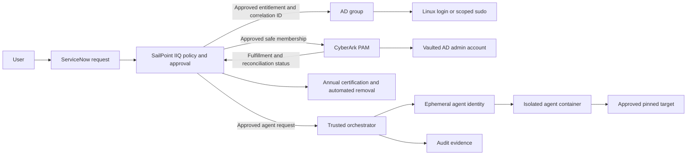

# Identity and agent access policy

This document is a proposed policy baseline and assessment artifact for an
organization using SailPoint IdentityIQ (IIQ), CyberArk, Active Directory (AD),
Linux systems, and this repository's agent pipeline. It requires approval and
tailoring by the organization's identity, security, privacy, records, and
authorizing officials before operational use.

## Purpose and scope

This policy governs:

- Human access to Linux environments through AD groups.
- Privileged access to AD administrative accounts protected by CyberArk.
- Non-human identities used to operate agents in the pipeline.

It does not authorize production access, grant an agent an AD account, or
replace the organization's incident response, records retention, or risk
acceptance processes.

## Policy statements

### Human access governance

1. Access to a Linux environment requires an approved request for a
   purpose-specific AD group. AD group membership is an authorization
   entitlement, not an assertion that a person is permanently trusted.
2. SailPoint IIQ is the authoritative governance record for entitlement
   ownership, policy evaluation, approvals, expiration, certification, and
   removal decisions.
3. ServiceNow is the request front end. Each request must carry an immutable
   correlation ID through approval, fulfillment, reconciliation, and closure.
4. Each access group must have a named business owner and technical owner.
   The manager and the system owner must approve access unless an approved
   policy defines a narrower alternative.
5. Access is recertified at least annually. The system owner must review
   privileged access; the manager must review user need. A failed or
   uncompleted certification results in removal or an approved, time-bound
   exception.
6. Removal must be automatic for termination, loss of eligibility, expiration,
   failed certification, and approved role-change events. Failed removals must
   create a tracked exception and alert the entitlement owner.

### Privileged access

1. A general Linux-login AD group must not also grant administrative privilege.
   Administrative access requires a separate privileged AD group and approval.
2. Linux systems must map the privileged group to only the required `sudo`
   commands; unrestricted administrator access requires explicit system-owner
   approval and a documented business need.
3. CyberArk PAM is the system of record for the vaulted AD administrative
   account, its password rotation, and credential release controls. Passwords
   must not be stored in SailPoint IIQ, ServiceNow, pipeline artifacts, source
   code, or agent containers.
4. SailPoint IIQ may request and govern CyberArk safe or account membership,
   but CyberArk fulfillment must include the IIQ approval and correlation ID.
   Direct CyberArk changes are exceptions subject to reconciliation and review.
5. CyberArk safe membership, account ownership, and AD privileged-group
   membership must be reconciled with IIQ at least daily during the pilot and
   on a risk-based schedule thereafter.

### Agent identity

1. An agent is a non-human workload identity. A human's AD group membership
   must not directly make an agent trusted or grant the agent the human's
   privileges.
2. Every agent run must have an ephemeral, purpose-bound identity created by
   the trusted orchestrator after an approved request. The identity must have:

   | Required attribute | Requirement |
   | --- | --- |
   | Agent run ID | Unique per execution |
   | Human sponsor | Requester and approver identifiers |
   | Correlation ID | ServiceNow and IIQ request identifier |
   | Purpose | Approved assessment or engineering task |
   | Target scope | Named repository, pinned commit, and target |
   | Allowed tools | Minimum required tool set |
   | Credential scope | Model API or explicitly approved service only |
   | Lifetime | Short-lived; expires at run completion |

3. Agent containers must not receive AD credentials, CyberArk account
   passwords, broad cloud credentials, home directories, or production
   credentials.
4. CyberArk may store the orchestrator's broker or service credentials.
   Secret retrieval must be short-lived, scoped to the approved action, and
   auditable. Agents must not retrieve reusable vault passwords directly.
5. The orchestrator must revoke or allow expiry of agent credentials when the
   run completes, fails, or is cancelled. It must retain the link between the
   sponsor, approval, run, target, actions, and output artifacts.

## Operating flow



1. A user requests a purpose-specific entitlement in ServiceNow.
2. IIQ evaluates eligibility and policy, obtains required approvals, and
   records the decision.
3. IIQ provisions the approved AD-group entitlement and, for privileged access,
   CyberArk safe/account membership. CyberArk retains and rotates the
   administrator credential.
4. The Linux environment authorizes login through the approved AD group and
   maps any privileged group only to the authorized `sudo` capability.
5. IIQ reconciles fulfillment evidence, schedules annual certification, and
   automatically initiates removal when required.
6. For agent work, the orchestrator consumes the approved request, creates a
   short-lived run identity, starts the constrained container, and records
   execution evidence. The agent receives only the credentials and access
   required for that run.

## Minimum viable pilot

Begin with one non-production Linux environment, one AD login group, one
separate privileged group, one CyberArk safe, and a small set of named users.
Use manual exception handling while authoritative identity data, group
ownership, and reconciliation quality mature. Do not automate broad joiner,
mover, leaver behavior or grant production access until the pilot produces
reliable fulfillment and removal evidence.

## Assessment evidence from this repository

The following code and configuration excerpts demonstrate technical controls
that support the agent-identity policy. They are implementation evidence, not
proof that an organization's SailPoint, CyberArk, AD, or Linux controls are
configured effectively.

### Agents receive a constrained tool set

`harness/agent.py` defines the default set of tools available to an agent:

```python
DEFAULT_TOOLS = ["Read", "Write", "Bash"]

def build_claude_argv(..., tools: list[str] | None, ...) -> list[str]:
    effective_tools = tools if tools else DEFAULT_TOOLS
    ...
    "--tools", ",".join(effective_tools),
```

This establishes an allowlist that can be narrowed for specific phases. For
example, the report grader is invoked without tools in `harness/report.py`:

```python
result = await run_agent(
    prompt=prompt,
    ...
    tools=[],
)
```

### Find and grade are separated by a narrow artifact boundary

`harness/grade.py` creates a fresh grading container and transfers only the
proof-of-concept bytes:

```python
with sandbox.agent_container(target.image_tag, container_name, agent_env) as container:
    docker_ops.write_file(container, "/tmp/poc.bin", crash.poc_bytes)
    adapted_cmd = crash.reproduction_command.replace(crash.poc_path, "/tmp/poc.bin")
```

This is the model for identity integrations: a downstream system should receive
only the approved, required artifact or claim, not the upstream system's
credentials or broad environment state.

### Network and filesystem isolation are policy-enforcing controls

`docs/agent-sandbox.md` documents the intended isolation boundary:

```text
Agent Read/Write: container filesystem only
Agent Bash: container shell only
Network egress: configured allowlist (default api.anthropic.com:443)
```

The same document requires that credential directories not be mounted into
agent containers. The operational deployment must independently verify the
runtime, mounts, egress allowlist, and identity-token expiry.

### Target scope is explicit and pinned

`harness/config.py` loads a named target and pinned source metadata:

```python
name=target_dir.name,
image_tag=cfg["image_tag"],
github_url=cfg["github_url"],
commit=cfg["commit"],
binary_path=_safe_container_path("binary_path", cfg["binary_path"]),
source_root=_safe_container_path("source_root", cfg["source_root"]),
```

An agent run should record the equivalent target-scope fields alongside its
human sponsor, request ID, token lifetime, and approval evidence.

## Required evidence for each operational run

Retain the following according to the organization's approved records schedule:

| Evidence | System of record |
| --- | --- |
| Request, justification, sponsor, approvers, and decision | ServiceNow and IIQ |
| Entitlement owner, policy result, certification, and removal event | IIQ |
| Vault account, safe membership, credential rotation, and fulfillment status | CyberArk |
| AD group membership and Linux authorization mapping | AD and Linux configuration management |
| Agent run ID, target scope, token issuance/expiry, tool policy, and container runtime | Orchestrator and platform audit logs |
| Egress policy, sandbox verification, transcripts, and resulting artifacts | Pipeline results and security logging platform |

## Control exceptions

Exceptions require a documented business justification, approving authority,
compensating controls, explicit expiration, and evidence of review. Emergency
or break-glass access must use a distinct, monitored process with an incident
record, short duration, immediate reconciliation, and post-use review.
